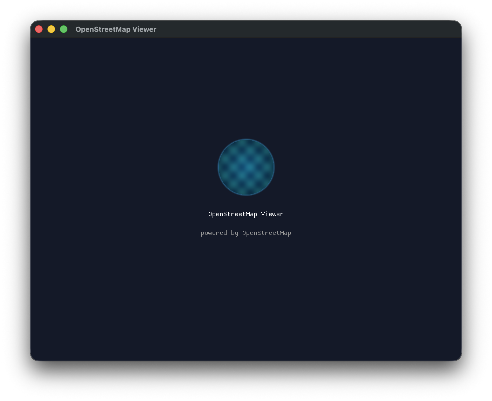
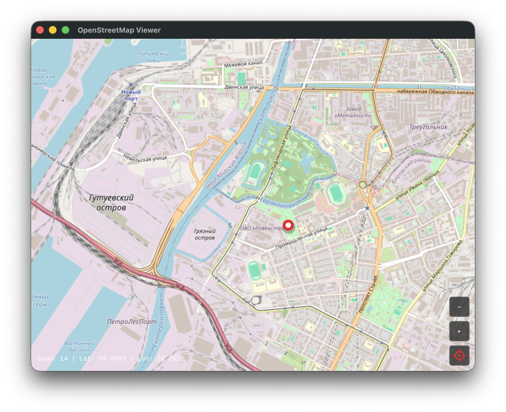

# OpenStreetMap Viewer (C++)

A native OpenStreetMap tile viewer for macOS, written in C++17 with Dear ImGui.



## Features

- **Splash screen** with procedurally generated globe logo
- **OpenStreetMap tile rendering** (256x256 px tiles from tile.openstreetmap.org)
- **Pan** — click and drag to move the map
- **Zoom** — scroll wheel or +/− buttons (zoom levels 1–19)
- **Geolocation** — detect your location via IP (ipapi.co)
- **"You are here" marker** — red pin with label at your coordinates
- **Long-press flags** — hold mouse button 0.5s to drop a colored flag, 8 colors cycle automatically
- **Persistent flags** — saved to `~/.osm-map-flags.txt`, restored on restart
- **Coordinate display** — zoom level, latitude, and longitude shown in the corner



## Tech Stack

| Library | Purpose |
|---|---|
| [Dear ImGui](https://github.com/ocornut/imgui) | Immediate-mode GUI |
| [GLFW](https://www.glfw.org/) | Windowing and OpenGL context |
| OpenGL 3.2 | Rendering |
| [libcurl](https://curl.se/libcurl/) | HTTP requests (tiles + geolocation) |
| [stb_image](https://github.com/nothings/stb) | PNG decoding |

## Requirements

- macOS 13+
- CMake 3.15+
- GLFW 3 (`brew install glfw`)

## Build

```bash
cmake -B build
cmake --build build
```

## Run

```bash
./build/osm_map_cpp
```

Or launch via the app bundle:

```bash
open OsmMap.app
```

## Usage

| Action | Control |
|---|---|
| Pan | Click and drag |
| Zoom in/out | Scroll wheel or +/− buttons |
| Drop flag | Long-press (0.5s) on the map |
| My location | Click the red crosshair button |

## Architecture

Single-file application (`src/main.cpp`) with a background thread for tile fetching:

1. **Startup** — synchronous IP geolocation request (fallback: Moscow, 55.76°N 37.62°E)
2. **Splash screen** — displayed for 3 seconds
3. **Map view** — tiles fetched on demand via background worker thread
4. **Rendering** — Dear ImGui `AddImage()` for tiles, `AddRectFilled()` for placeholders, `AddCircleFilled()` for markers and flags

### Tile Loading

- Background thread pulls `(x, y, zoom)` jobs from a shared `std::deque`
- Downloads from `https://tile.openstreetmap.org/{z}/{x}/{y}.png`
- Decodes PNG via stb_image, uploads as OpenGL texture
- Dedup guard prevents re-requesting tiles already loaded or in-flight
- Queue capped at 64 entries, max 8 textures created per frame

### Pan & Zoom

- **Pan**: mouse drag converts pixel delta to lat/lon via Mercator tile math
- **Zoom**: scroll wheel or buttons, clears all tiles and re-fetches at new zoom level

### Long-Press Flags

- Hold mouse button for 0.5s without moving (>10px cancels)
- Flag placed using inverse Mercator projection via tile coordinates
- 8 colors cycle: red → green → blue → yellow → purple → cyan → orange → violet
- Flags persist across restarts in `~/.osm-map-flags.txt`

## Project Structure

```
osm-map-cpp/
├── CMakeLists.txt
├── src/
│   └── main.cpp           # All application logic
├── vendor/
│   ├── imgui.*             # Dear ImGui core
│   ├── imgui_impl_glfw.*   # GLFW backend
│   ├── imgui_impl_opengl3.*# OpenGL3 backend
│   └── stb_image.h         # PNG decoder
├── screenshots/
│   ├── 01_splash_screen.png
│   └── 02_map_view.png
└── README.md
```

## Credits

- Map data © [OpenStreetMap](https://www.openstreetmap.org/) contributors
- Tile server: [tile.openstreetmap.org](https://tile.openstreetmap.org/)
- Geolocation: [ipapi.co](https://ipapi.co/)

## License

MIT
